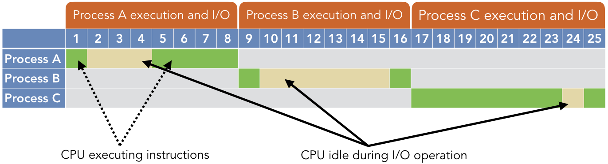
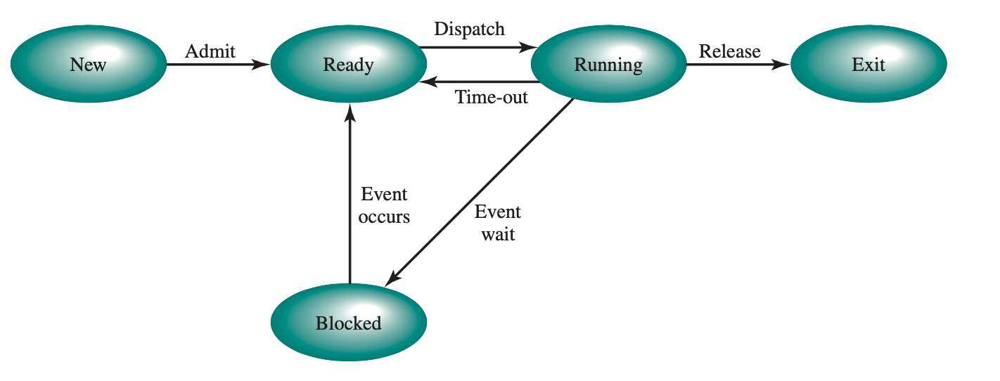
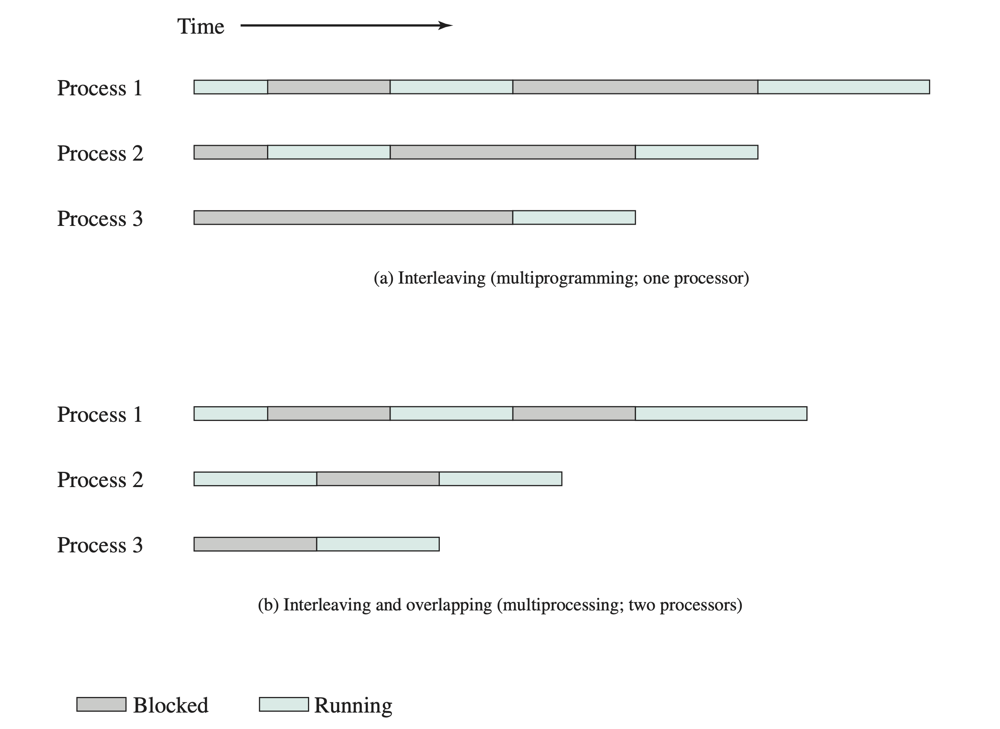
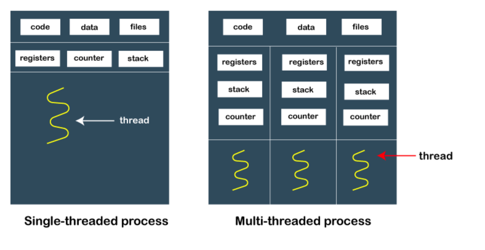

# Introducción
## Definición
La programación concurrente es un paradigma en el desarrollo de software que permite ejecutar múltiples tareas o procesos simultáneamente, ya sea mediante una ejecución paralela real (como en sistemas multicore o multiprocesador) o intercalando tareas de manera que parezca que se ejecutan al mismo tiempo.

[//]: # (TTodo lo de Ley de Moore me lo voy a meter bien en el orto)
> **Nota:**
> Es importante diferenciar un sistema **multicore** de uno **multiprocesador**, siendo el primero un sistema que tiene múltiples núcleos de procesamiento en un solo chip, mientras que el segundo tiene múltiples chips, cada uno con su propio núcleo.  
> En ambos casos, la programación concurrente permite aprovechar al máximo los recursos del sistema y mejorar el rendimiento de las aplicaciones.

> Todo esto de teoría va a ser un bodrio, va a estar mucho más simplificada la práctica

## ¿Por qué surge?
- La necesidad de mejorar el rendimiento y la eficiencia de los sistemas informáticos.
- La mayoría de los programas y sistemas eran single-threaded, por lo que había que reducir tiempos de ejecución.

Previo a hablar de programación concurrente, es importante entender el concepto de **multiprogramming**.
## Multiprogramming
- Permite que varios programas se carguen en memoria y se ejecuten de manera concurrente.
- El sistema operativo gestiona la ejecución de los programas, asignando tiempo de CPU a cada uno de ellos.
- Gestiona el tiempo de ejecución de cada programa con tal de que la CPU siempre esté ocupada.

## Sistemas Operativos y Time-Sharing
- Time-sharing: una extensión lógica de multiprogramación.
- El tiempo del procesador se comparte entre varios usuarios al mismo tiempo
- Se crea la ilusión de una máquina rápida y dedicada para cada usuario

## ¿Por qué aplicamos programación concurrente?
- **Uso de recursos**: uso eficiente del tiempo de inactividad durante operaciones de entrada/salida.
- **Equidad**: compartición equitativa de recursos entre múltiples usuarios o programas.
- **Conveniencia**: facilita la gestión de múltiples tareas o procesos.

[//]: # (Es necesario que hable de qué es un proceso?)

---

## Scheduling

### Cooperativo

Las tareas ceden voluntariamente el control de la CPU, permitiendo que otras tareas se ejecuten.

#### Características Clave

- **Control de Tarea**: Las tareas controlan su propia cesión de la CPU.

- **Cesión**: Una tarea cede la CPU cuando está inactiva o cuando decide permitir que otras tareas se ejecuten.

- **Ventajas**: Simplicidad, baja sobrecarga, utilización predecible de recursos.

- **Desafíos**:

  - Depende de que las tareas se comporten correctamente.

  - Una sola tarea mal comportada puede acaparar la CPU, afectando la capacidad de respuesta del sistema.

#### Casos de Uso Ideales

- Entornos donde las tareas pueden ser confiables para ceder regularmente.

- Sistemas que priorizan la simplicidad sobre la eficiencia del multitarea.

### Preventivo

El sistema operativo controla la ejecución de las tareas, interrumpiendo y reanudándolas por la fuerza según sea necesario para garantizar una asignación justa y eficiente de recursos.

#### Características Clave

- **Controlado por SO**: El SO decide cuándo una tarea debe ceder la CPU.

- **Partición de Tiempo**: Las tareas tienen porciones de tiempo de CPU y son preemptadas cuando las exceden.

- **Ventajas**: Mejor capacidad de respuesta, equidad, mejor manejo de tiempo real.

- **Desafíos**:

  - Mayor complejidad en la implementación.

  - Potencial para contención de recursos y sobrecarga asociada.

#### Casos de Uso Ideales

- Sistemas operativos de propósito general.

- Entornos donde las tareas no pueden ser confiables para ceder regularmente.

- Sistemas de tiempo real que necesitan tiempos de respuesta garantizados.

---
[//]: # (Dudo que se pongan en gedes con cómo funciona un Context Switch, pero lo agrego igual)
# Cambio de Contexto
- El proceso de guardar el estado de una tarea actualmente en ejecución y cargar el estado de otra tarea.

## ¿Qué guarda como estado?
- **Program Counter**: dirección de la siguiente instrucción
- **Registros de la CPU** en ese momento
- **Stack**: variables locales, parámetros de funciones, y direcciones de retorno
- Información de manejo de memoria y otros.

---
# Concurrencia vs Paralelismo vs Interleaving
## Concurrencia
- La concurrencia se refiere a la capacidad de un sistema para gestionar múltiples tareas u operaciones al mismo tiempo.
- No significa necesariamente que estas operaciones se estén ejecutando simultáneamente.
- En los sistemas concurrentes, diferentes partes de una tarea o múltiples tareas pueden estar en progreso al mismo tiempo, pero no necesariamente tienen que estar ejecutándose en el mismo momento exacto.
> La concurrencia trata sobre la estructura.

## Paralelismo
- El paralelismo se refiere a la ejecución de múltiples tareas o procesos simultáneamente.
- Esto requiere hardware con múltiples unidades de procesamiento, como procesadores multi-núcleo.
- En los sistemas paralelos, las tareas se ejecutan literalmente al mismo tiempo, como líneas de ensamblaje paralelas en una fábrica trabajando simultáneamente.
> El paralelismo trata sobre la ejecución.

## Interleaving / Intercalado
Una técnica para alternar rápidamente entre tareas, ejecutándolas en pequeños fragmentos.

### Características clave
- Simula el paralelismo.
- Enfoque de compartición de tiempo: el tiempo de CPU se divide entre múltiples procesos en sucesión rápida.
- Eficiencia: proporciona una utilización eficiente de la CPU al reducir el tiempo de inactividad durante las tareas, como las operaciones de entrada/salida.
- Ejemplo: un chef que prepara múltiples platos alternando entre ellos, en lugar de cocinar cada uno de principio a fin.
### Contraste con Overlapping

## Procesos vs. Threads

- **Programa**
> Una colección de instrucciones y datos que pueden ser ejecutados por una computadora para realizar una tarea o función específica.

- **Proceso**
> Una instancia en ejecución de un programa. Es una unidad independiente que consiste en su propio espacio de direcciones, memoria, datos y recursos del sistema.

- **Thread**
> La unidad más pequeña de ejecución dentro de un proceso.\
> Representa una secuencia única de instrucciones que puede ser programada por el scheduler del sistema.\
> Múltiples hilos dentro de un proceso comparten el mismo espacio de memoria pero tienen su propio

### Tipos de threads
- **User-Level**: El trabajo de gestión de hilos lo hace la aplicación y el kernel no es consciente de la existencia de estos hilos.
- **Kernel-Level**: Todo el trabajo de gestión de hilos lo realiza el kernel. A nivel de aplicación hay una API para la funcionalidad de hilos del kernel.

| Característica | Hilos a Nivel de Usuario | Hilos a Nivel de Kernel |
|---|---|---|
| Implementación | En espacio de usuario | En espacio de kernel |
| Tiempo de Cambio de Contexto | Rápido | Más lento |
| Sobrecarga/Consumo de Memoria | Bajo | Mayor |
| Reconocimiento del SO | No reconocidos | Reconocidos |
| Programación | Por biblioteca de nivel de usuario | Por kernel del SO |
| Asignación de Recursos | No directa | Directa |
| Bloqueo | Un hilo puede bloquear todo el proceso | Bloqueo independiente |
| Rendimiento en Multi CPU | Limitado | Mejor |
