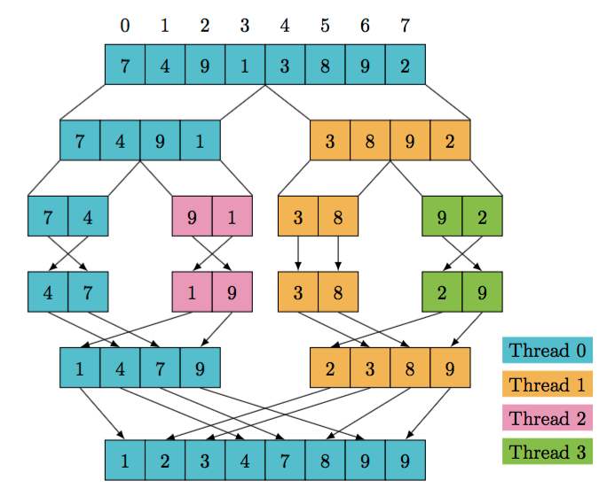

# Paralelismo
Esta clase todo lo que hace es mostrar implementaciones concurrentes de resolver algoritmos iterativos, que terminan siendo dividir los cálculos en algún punto, spawnear un thread en esa división y seguir calculando.

Después de eso se espera que el thread termine y se junten los resultados.
## Ejemplo
Si queremos calcular $2*k*a*t*e^{-a * t}$, podemos:
- Primero calcular $ 2*k*a*t $
- Después calcular $ e^{-a * t} $
- Finalmente, multiplicar los resultados de los dos pasos anteriores.

### Implementación secuencial
```rust
fn evaluate_sequential(k: f64, a: f64, t: f64) -> f64 {

    let a = 2.0 * k * a * t;
    let b = f64::exp(-a * t * t);
    
    return a * b;
}
```

### Implementación concurrente
```rust
use std::thread;

fn evaluate_parallel(k: f64, a: f64, t: f64) -> f64 {

    let thread1 = thread::spawn(
        || 2.0 * k * a * t
    );
    let thread2 = thread::spawn(
        || f64::exp(-a * t)
    );

    let a = thread1.join().unwrap();
    let b = thread2.join().unwrap();

    return a * b;
}
```

Se puede hacer una pequena optimización, en vez de crear dos threads, podemos crear uno solo y hacer el cálculo de $e^{-a * t}$ dentro del thread. Esto es para que el thread principal no se quede esperando a que termine el otro thread, con tal de seguir ejecutando el resto del código.

```rust
use std::thread;

fn evaluate_parallel_opt(k: f64, a: f64, t: f64) -> f64 {
    let first_half = 2.0 * k * a * t;

    let thread2 = thread::spawn(|| f64::exp(-a * t));

    let second_half = thread2.join().unwrap();

    return first_half * second_half;
}
```

## Observación importante
A veces, no siempre es mejor hacer implementaciones paralelas, dado que puede suponer un overhead a partir de los cambios de contexto.

Si el cálculo es muy rápido, el overhead de crear un thread puede ser mayor que el tiempo que se tarda en calcular el resultado de manera iterativa.

### Ejemplo - MergeSort
```rust
pub fn merge(first: &[i32], second: &[i32]) -> Vec<i32>{
    let mut result = Vec::new();
    let mut i = 0; let mut j = 0;
    
    // Merge until one of the inputs is exhausted
    while i < first.len() && j < second.len() {
        if first[i] <= second[j] {
            result.push(first[i]);
            i += 1
        } else {
            result.push(second[j]);
            j += 1
        }
    }
    // Copy the remaining items
    result.extend_from_slice(&first[i..]);
    result.extend_from_slice(&second[j..]);
    result
}

pub fn sort(array: &[i32]) -> Vec<i32> {
    let len = array.len();
    if len <= 1 {
        array.to_vec()
    }
    else {
        let (first, second) = thread::scope(|s| {
            let x = sort(&array[..len / 2]); // First half
            let y = s.spawn(|| sort(&array[(len / 2) + 1..])); // Second half
            (x, y.join().unwrap()) // <-- Scope also returns a value
        });
        merge(&first, &second)
    }
}
```



Por lo general se optimiza de la siguiente manera (conceptualmente):
- Se implementan ambos métodos de cálculo (**secuencial** y **concurrente**)
- Si se supera un cierto **threshold** o límite, se llama al método concurrente
  - Este threshold va a variar dependiendo del caso y del algoritmo a implementar
  - Inclusive puede variar según la máquina donde se esté corriendo
- Si no, se opera con el método secuencial.

Esto se hace para **evitar cambios de contexto innecesarios**. Los threshold se obtienen/determinan a prueba y error.

## Más ejemplos

### Matriz
```rust
#[derive(Debug, Clone)]
pub struct Matrix(pub Vec<Vec<f64>>);

impl Matrix {
    pub fn rows(&self) -> usize { self.0.len() }
    pub fn columns(&self) -> usize { self.0[0].len() }
}
```

```rust
// Suma de matrices
pub fn add_serial(&self, other: &Matrix) -> Matrix {
        let rows = self.rows();
        let cols = self.columns();
        let mut result = Vec::new();

        for i in 0..rows {
            let mut row = Vec::new();
            for j in 0..cols {
                row.push(self.0[i][j] + other.0[i][j]);
            }
            result.push(row);
        }
        Matrix(result)
    }
// Secuencial con map
pub fn add_serial(&self, other: &Matrix) -> Matrix {
    let rows = self.rows();
    let cols = self.columns();
    let result = (0..rows)
        .map(|i|
            (0..cols)
                .map(|j| self.0[i][j] + other.0[i][j])
                .collect()
        )
        .collect();
    Matrix(result)
}
```

```rust
// Paralelo, fila por fila
pub fn add_parallel(&self, other: &Matrix) -> Matrix {
    let rows = self.rows();
    let cols = self.columns();

    thread::scope(|s| {
        let threads: Vec<_> = (0..rows)
            .map(|i| {
                s.spawn(move || {
                    (0..cols).map(|j| self.0[i][j] + other.0[i][j]).collect()
                })
            })
            .collect();

        Matrix(threads.into_iter()
            .map(|t| t.join().unwrap())
            .collect())
    })
}
```

