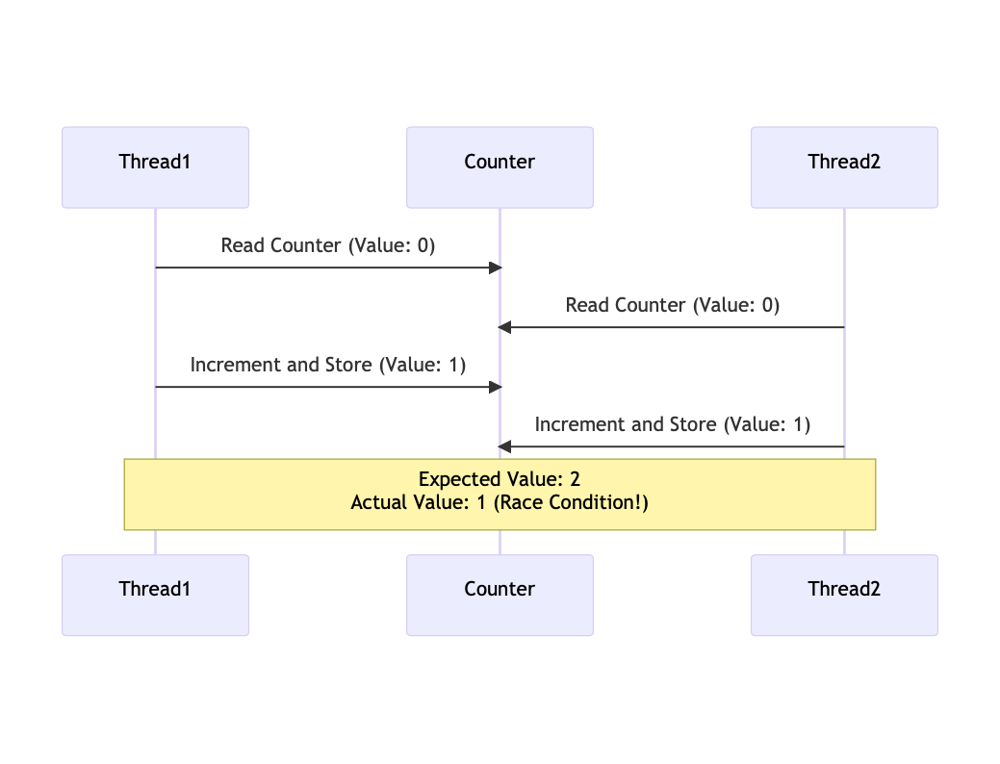

# Exclusión Mutua

## La raíz del problema
- No determinismo causado por hilos concurrentes accediendo a un **estado mutable compartido**.
- Ayuda encapsular el estado en actores o transacciones, pero el problema fundamental sigue siendo el mismo.

## No determinismo = procesamiento paralelo + estado mutable.
- Para obtener un procesamiento determinista, **¡evita el estado mutable!**
- Evitar el estado mutable significa **programar funcionalmente**.

## Condición de carrera
Una condición de carrera ocurre cuando dos o más operaciones deben ejecutarse en una secuencia específica, pero el comportamiento sustancial del sistema no está garantizado, llevando a resultados erráticos e impredecibles.

### Ejemplo en Java
```java
public class Counter {
    int value = 0;

    void increment() {
        int localCounter = value;
        System.out.println(threadName() + " reads counter as: " + localCounter);

        localCounter = localCounter + 1;
        
        value = localCounter;
        System.out.println(threadName() + " updated counter to: " + value);
    }
}

public class Main {
    public static void main(String[] args) {
        var counter = new Counter();

        // Two threads trying to increment the counter simultaneously
        Thread t1 = new Thread(counter::increment, "Thread 1");
        Thread t2 = new Thread(counter::increment, "Thread 2");

        startAll(t1, t2);
        joinAll(t1, t2);

        System.out.println("Expected value: 2, actual value: " + counter.value);
    }
}
``` 

#### Output:
```
Thread 1 reads counter as: 0
Thread 2 reads counter as: 0
Thread 1 updated counter to: 1
Thread 2 updated counter to: 1
Expected value: 2, actual value: 1
```



### Solución: Forzar Acceso Único
Si forzamos una regla de que solo un proceso puede entrar al método incrementar a la vez entonces:

- _Thread1_ entra a incrementar primero y crea un bloqueo
- _Thread2_ intenta entrar pero es bloqueado
- _Thread1_ completa la ejecución y libera el bloqueo
- _Thread2_ se reanuda y ejecuta incrementar

```java
public class Counter {
    int value = 0;

    synchronized void increment() {
        int localCounter = value;
        System.out.println(threadName() + " reads counter as: " + localCounter);

        localCounter = localCounter + 1;
        
        value = localCounter;
        System.out.println(threadName() + " updated counter to: " + value);
    }
}
```

Nótese que el keyword `synchronized` en Java es un ejemplo básico de un lock (específicamente de un Mutex).
- Si se hace **sobre un método**, el lock es sobre el objeto que contiene el método.
- Si se hace **sobre un bloque**, el lock es sobre el objeto que se le pasa al bloque.
- Si se hace **sobre una variable o atributo de la clase**, el lock es sobre la variable o atributo.
- Si se hace sobre un **método estático**, el lock es sobre la clase.

# Memoria compartida entre hilos
```java
public class Test {
    boolean a = false, b = false;
    int x = -1, y = -1;
    
    void test(int execution) {
        var t1 = new Thread(() -> {
            sleep(1);
            a = true;
            y = b ? 0 : 1;
        });
        var t2 = new Thread(() -> {
            sleep(1);
            b = true;
            x = a ? 0 : 1;
        });
        startAll(t1, t2);
        joinAll(t1, t2);

        if (x == 1 && y == 1)
            throw new RuntimeException("Failed at execution number : " + execution);
    }
}
```
Posibles casos para el programa anterior:
- **Primera alternativa:** `t1` corre primero  
`t1` escribe `true` en `a`, luego lee `b` y ve `false` → escribe `1` en `y`  
`t2` escribe `true` en `b`, luego lee `a` y ve `true` → escribe `0` en `x`  
Resultado: `x == 0` y `y == 1`

- **Segunda alternativa:** `t2` corre primero  
`t2` escribe `true` en `b`, luego lee `a` y ve `false` → escribe `1` en `x`  
`t1` escribe `true` en `a`, luego lee `b` y ve `true` → escribe `0` en `y`  
Resultado: `x == 1` y `y == 0`

- **Tercera alternativa:** Ejecución parcial  
`t1` escribe `true` en `a` y es interrumpido  
`t2` escribe `true` en `b`  
Luego, tanto `t1` como `t2` ven ambos valores en `true`, así que escriben `0` en `x` e `y`  
Resultado: `x == 0` y `y == 0`

**Conclusión:** No existe ninguna ejecución en la que `x == 1` y `y == 1`

## Pongámoslo a prueba
```java
public static void main(String[] args) {
	for (var i = 0; i < 10_000; i++)
    	new Test().test(i);
}
```
**Output**:
```
Exception in thread "main" java.lang.RuntimeException: Failed at execution number : 880
	at org.example.counter.Test.test(Test.java:25)
	at org.example.counter.Test.main(Test.java:30)
```
### ¿Por qué falló?
Los hilos pueden correr en distintos núcleos usando su propia memoria (por ejemplo, `L1 cache`).
Los threads se sincronizan a través de la memoria compartida, por ejemplo, después de hacer join.
Entonces, esto es posible:
- `t1` escribe `true` en `a`, luego lee `b` y ve `false` → escribe `1` en `y`
- `t2` escribe `true` en `b`, luego lee `a` y ve `false` → escribe `1` en `x`
Porque `t2` tiene su propio valor de `a` que todavía no fue sincronizado.

En el ejemplo anterior en el que es virtualmente imposible que falle, la falla se da porque el thread que falló leyó memoria vieja (que ya no existe) respecto a una de las 2 variables, y actualizó la otra.

Es difícil compartir la memoria entre threads debido a estas cuestiones, por lo que en distintos lenguajes se implementan distintas formas de hacerlo.

En `Java`, se usa el keyword `volatile`. En este caso se declaran `a` y `b` con este keyword.

Esto fuerza a la JVM a sincronizar la variable hacia y desde la memoria compartida. `volatile` es ligero y más rápido que el bloqueo.

# Competencia por recursos
Ahora, otro de los problemas principales de la memoria compartida es que los procesos van a competir por recursos, lo que genera las siguientes necesidades y problemas: 
- **Necesidad de Exclusión Mutua**. Sólo un proceso a la vez debe ser permitido en la sección crítica del programa.
- **Deadlock**
- **Starvation**


## Deadlock
Deadlock puede ser definido como el bloqueo permanente de un conjunto de procesos que compiten por recursos.
Un conjunto de procesos está en deadlock cuando cada proceso en el conjunto está bloqueado
esperando por un recurso que está retenido por otro proceso bloqueado en el conjunto.


### Ejemplo
```java
public void transferTo(BankAccountSync to, double amount) {
  synchronized (this) {
	  // Lock over 'this' acquired
	
	  // Try to lock 'to'
	  synchronized (to) {
		// Lock over 't0' acquired.
		withdraw(amount);
		to.deposit(amount);
	  }
  	  // lock over 'to' released
  }
  // lock over 'this' released
}
```

## Starvation
Una situación donde a un proceso se le niegan perpetuamente los recursos que necesita para progresar, mientras que otros procesos son favorecidos, llevando a una espera indefinida.

En resumen, un proceso se muere de hambre porque quiere acceder a un recurso y siempre se le deniega dicho acceso.

### Ejemplo de solución de Starvation
```java
public class Counter {
    int value = 0;

    void increment() {
        disableInterruptions();
        
        int localCounter = value;
        localCounter = localCounter + 1;
        value = localCounter;

        enableInterruptions();
    }
}
```
- Esto sólo funciona en uni-procesadores
- Generalmente es ineficiente

### Otro ejemplo
```java
volatile boolean lock = false;

void increment() {
	while (lock) {
		// Busy Loop
	}
	lock = true;
	// Begin Critical Section
		int localCounter = value;
		System.out.println(threadName() + " reads counter as: " + localCounter);
	
		localCounter = localCounter + 1;
		value = localCounter;
	// End Critical Section
	lock = false;
	System.out.println(threadName() + " updated counter to: " + value);
}
```
- Necesito del keyword `volatile` para el lock justamente por estas cuestiones de sincronización.
- El problema radica acá:
```java
while (lock) {
	// Busy Loop
}
// Puedo tener un Context Switch acá !
lock = true;
```
La alternativa para estos casos es el uso de variables atómicas, otorgadas por el hardware (que veremos más adelante en [Non-Blocking Algorithms](../Clase%207/index.html)):
```java
void increment() {
	while (v.compareAndSet(false, true)) { 
		// busyLoop
	}
	// Critical section
	// ...
}
```
- **Lo bueno**: Aplicable a cualquier cantidad de procesos.
- **Lo malo**: El busy-waiting consume tiempo de procesador.
- **Solución**:
  - Después de girar un poco (spinning), **devolver el control al sistema operativo**.
  - `while (lock.compareAndSet(false, true)) Thread.yield();`

Por último, en clase vimos que Rust no puede tener condiciones de carrera porque es un lenguaje de verdad y el borrow checker lo evita (al menos con una variable mutable).

En casos más complejos lo resuelve de otra manera.

```rust
fn counter() -> i32 {
    let mut counter = 0;
    thread::scope(|s| {
        s.spawn(|| counter += 1);
        s.spawn(|| counter += 1);
    });
    return counter
}
```
Output:
```
error[E0499]: cannot borrow `counter` as mutable more than once at a time

... Etc..
```

Sin embargo, [según la documentación de Rust](https://doc.rust-lang.org/nomicon/races.html#:~:text=However%20Rust%20does%20not%20prevent%20general%20race%20conditions.&text=For%20this%20reason%2C%20it%20is,race%20condition%20or%20resource%20race.), el lenguaje previene específicamente Data Races, un subtipo de condiciones de carrera donde:
- Dos o más threads acceden concurrentemente un espacio de memoria
- Uno o más de ellos realiza una operación de escritura
- Uno o más de ellos no está sincronizado

Y dicha prevención proviene justamente de lo explicado anteriormente respecto al borrow checker.

Sin embargo, no nos protege de condiciones de carrera en general. Por ejemplo, veamos el siguiente caso:

```rust
fn main() {
    let data = vec![1, 2, 3, 4];

    let idx_mutex = Arc::new(Mutex::new(0));
    let other_idx_mutex = Arc::clone(&idx_mutex);

    let _ = thread::spawn(move || {
        let mut current_idx = other_idx_mutex.lock().unwrap();
        *current_idx += 10;
    });

    let current_index_value;
    {
        let idx_guard = idx_mutex.lock().unwrap();
        current_index_value = *idx_guard;
    }

    println!("{}", data[current_index_value]);
}
```

- Si el thread principal se termina de ejecutar y luego corre el thread que él mismo inicializa, el print funciona, mostrando el primer elemento del Vec.
- En cambio, si ese segundo thread logra ejecutarse primero, entonces `current_index_value = 10`. Esto provoca un panic en el print, ya que se intenta acceder al elemento 10 del Vec, pero solo tiene 4 elementos.

En consecuencia, se da una condición de carrera porque el programa puede ser exitoso o fallar dependiendo del orden de ejecución de los threads.
