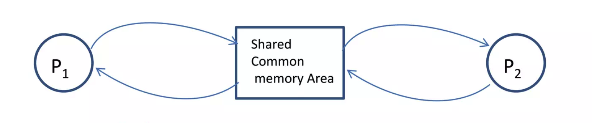
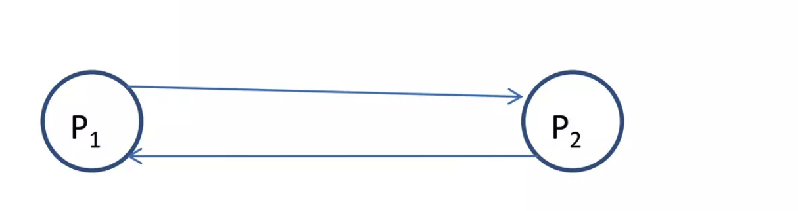
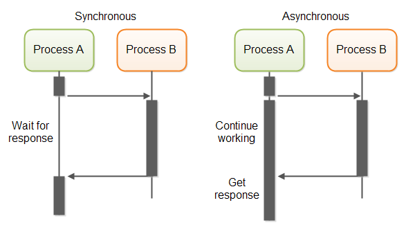

# Abstracciones de Concurrencia - Parte II

## Variables de Condición

Tienen como propósito hacer que los threads esperen una condición específica sin consumir recursos.
Similar a los semáforos, tienen 2 operaciones principales:

- **Esperar**: un thread espera a que una condición se cumpla. Si no se cumple, **libera el Mutex asociado de manera atómica** para evitar condiciones de carrera.
- **Señalizar**: un thread notifica a otro que la condición se ha cumplido. Esto despierta al thread que estaba esperando.

### Ejemplo de uso

```rust
// Sin condvar:
use std::sync::{Mutex, Arc};
fn main() {
    let queue = Mutex::new(VecDeque::new());

    thread::scope(|s| {
        s.spawn(|| {
            loop { // Busy loop !!
                let mut q = queue.lock().unwrap();
                if let Some(item) = q.pop_front() {
                    println!("Popped: {item}", );
                }
            }
        });

        for i in 0.. {
            queue.lock().unwrap().push_back(i);
            thread::sleep(Duration::from_secs(1));
        }
    }
    );
}
```

```rust
// Con condvar:
use std::sync::{Mutex, Condvar};
fn main() {
    let queue = Mutex::new(VecDeque::new());
    let not_empty = Condvar::new();

    thread::spawn(|| {
        loop {
            let mut q = queue.lock().unwrap();
            if let Some(item) = q.pop_front() {
                println!("Popped: {item}", );
            } else {
                q = not_empty.wait(q).unwrap(); // <--- Wait
            }
        }
    });

    // Pushear elementos:
    for i in 0.. {
        queue.lock().unwrap().push_back(i);
        not_empty.notify_one(); // <-- notify the first thread waiting
        thread::sleep(Duration::from_secs(1));
    }
}
```

### Beneficios

- Mecanismo de espera eficiente en programación concurrente
- Facilita escenarios de sincronización compleja

### Problema de Producers-Consumers
Involcura 2 tipos de hilos: **Productores** y **Consumidores**
- Los **productores** generan datos y los pushean a un buffer de memoria compartido.
- Los **consumidores** consumen esos datos y los procesan.

#### Implementación en Rust
```rust
struct CircularBuffer<T> {
    buffer: Vec<Option<T>>,
    capacity: usize,
    head: usize,
    tail: usize,
    size: usize,
}

impl<T> CircularBuffer<T> {

    pub fn add(&mut self, element: T) -> bool {
        if self.size == self.capacity {
            return false
        }
        let i = self.head;
        self.buffer[i] = Some(element);
        self.head = (i + 1) % self.capacity;
        self.size += 1;
        return true;
    }
    pub fn remove(&mut self) -> Option<T> {
        if self.size == 0 {
            return None
        }
        let i = self.tail;
        let result = self.buffer[i].take();
        self.tail = (i + 1) % self.capacity;
        self.size -= 1;
        result
    }
}
```

#### Implementación concurrente
```rust
struct Data<T> {
    buffer: Vec<Option<T>>,
    capacity: usize, head: usize, tail: usize, size: usize,
}

pub struct CircularBuffer<T> {
    data: Mutex<Data<T>>, // Se wrappean los datos en un mutex por cuestiones de sincronización
    // Se usan 2 variables de condición para notificar a cada tipo de hilo 
    not_empty: Condvar, // Para consumidores
    not_full: Condvar // Para productores
}

impl<T> CircularBuffer<T>{
    
    pub fn add(&self, element: T) {
        let mut data = self.data.lock().unwrap();     // Lock the Mutex
        while data.size == data.capacity {
            data = self.not_full.wait(data).unwrap(); // Wait until not full
        }

        data.buffer[data.head] = Some(element);
        data.head = (data.head + 1) % data.capacity;
        data.size += 1;

        self.not_empty.notify_one();                  // notify that is not empty
    }
    
    pub fn remove(&self) -> T {
        let mut data = self.data.lock().unwrap();      // Lock the mutex
        while data.size == 0 {
            data = self.not_empty.wait(data).unwrap(); // Wait until not empty
        }
        let result = data.buffer[data.tail].take();
        data.tail = (data.tail + 1) % data.capacity;
        data.size -= 1;
        self.not_full.notify_one();                    // Notify that is not full
        result.unwrap()
    }
}
```

## Monitores

Es una primitiva de sincronización que le permite a los threads tener:

- Exclusión mutua
- La capacidad de bloquear la ejecución si no se cumple una condición específica
- Un mecanismo de señalización para despertar threads que están esperando por la misma condición

En resumen, es un `Mutex` + una `CondVar`

En Rust no existen los monitores como tal, pero se pueden implementar usando `Mutex` y `Condvar`.

En Java sí están built-in, pero no como objeto, sino mediante el uso del keyword `synchronized` y los métodos `wait()`,
`notify()` y `notifyAll()`.

```java
class Account {
    double balance;

    synchronized public void withdraw(double amount) throws InterruptedException {
        if (amount <= 0) return;

        while (balance < amount) {
            // Wait for enough balance");
            wait();
        }
        balance -= amount;
    }

    synchronized public void deposit(double amount) {
        if (amount > 0) {
            balance += amount;
            notify(); // Notify that some money have been deposited
        }
    }
}
```

### Problema de Producer-Consumer en Java con Monitores
```java
public class CircularBuffer<T> {
    List<T> buffer;
    int capacity, head, tail, size;

    public CircularBuffer(int capacity) {
        buffer = new ArrayList<>(capacity);
        this.capacity = capacity;
    }
    
    public synchronized void add(T element) throws InterruptedException {
        while (size == capacity) wait();
        buffer.set(head, element);
        head = (head + 1) % capacity;
        size += 1;
        notifyAll();
    }

    public synchronized T remove() throws InterruptedException {
        while (size == 0) wait();
        var result = buffer.get(tail);
        tail = (tail + 1) % capacity;
        size -= 1;
        notifyAll();
        return result;
    }
}
```

## Pasaje de mensajes

La idea de los mensajes es evitar la comunicación entre threads mediante la compartición de memoria. Esto lo logra "intentándolo al revés", es decir, **compartiendo memoria a través de la comunicación**.

Pasar de esto:


A esto:


- En el pasaje de mensajes, la información a compartir es copiada físicamente desde el espacio de direcciones del proceso remitente a los espacios de direcciones de todos los procesos destinatarios
- Esto se logra transmitiendo los datos en forma de mensaje
- Un mensaje es simplemente un bloque de información

### Mensajes síncronos vs. asíncronos



| Característica          | Síncrono                                              | Asíncrono                                    |
| ----------------------- | ----------------------------------------------------- | -------------------------------------------- |
| Sincronización          | El emisor espera a que el receptor obtenga el mensaje | El emisor continúa sin esperar               |
| Control de Flujo        | Automático mediante el bloqueo del emisor             | Requiere gestión explícita                   |
| Complejidad             | Menor, debido a la coordinación directa               | Mayor, debido al manejo indirecto            |
| Caso de Uso             | Ideal para tareas estrechamente acopladas             | Ideal para tareas independientes             |
| Rendimiento             | Puede ser más lento debido a las esperas              | Mayor, ya que no implica esperas             |
| Utilización de Recursos | Menor durante las esperas                             | Mayor, ya que las tareas siguen ejecutándose |

En Rust esto se logra a través de los `channels`, que vienen de la librería `std::mpsc`.

```rust
fn channels_example() {
    // Create a channel
    let (sender, receiver) = mpsc::channel();
    // MPSC = Multiple Producer, Single Consumer
    // Spawn a new thread
    thread::spawn(move || {
        // Send a message to the channel
        let msg = "Hello from the spawned thread!";
        sender.send(msg).unwrap();
        println!("Sent message: '{}'", msg);
    });

    // Receive the message in the main thread
    let received = receiver.recv().unwrap();
    println!("Received message: '{}'", received);
}
```

```rust
fn other_example() {
    // Create a Channel:
    let (sender, receiver) = mpsc::channel();

    // Spawn many threads
    for tid in 0..10 {
        let s = sender.clone();   // <--- Clone the sender part
        thread::spawn(move || {
            // Send a message to the channel
            let msg = format!("Hello from thread! {tid}");
            println!("Sent message: '{}'", msg);
            s.send(msg).unwrap();
        });
    }
}
```
