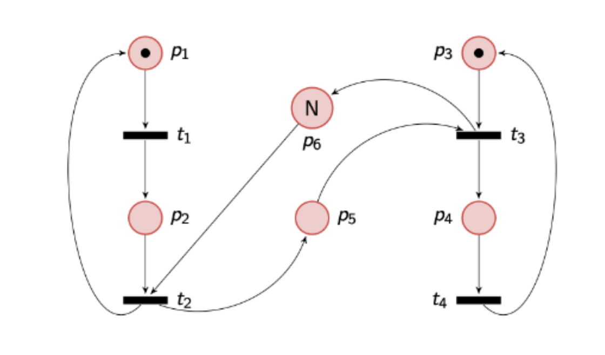

# Parcial 1C 2024

## Enunciado
**1.** Revisando el diseño aplicado en algunos proyectos, se encontró el uso de las siguientes herramientas para resolver problemas de concurrencia. Para cada uno de los problemas enuncie ventajas o desventajas de utilizar la solución propuesta y menciona cual utilizaría usted:

- Renderizado de videos 3D en alta resolución, utilizando programación asincrónica.
- Aplicación que arma una nube de palabras a partir de la API de Twitter, utilizando barriers y mutex.
- Una aplicación para realizar una votación en vivo para un concurso de televisión, optimizada con Vectorización.

**2.** **Programación asincrónica**. Elija verdadero o falso y explique brevemente por qué:
- El encargado de hacer poll es el thread principal del programa.
- El método poll es llamado únicamente cuando la función puede progresar.
- El modelo piñata es colaborativo.
- La operación asincrónica inicia cuando se llama a un método declarado con async.

**3.** Para cada uno de los siguientes fragmentos de código indique si es o no es un busy wait. Justifique en cada caso 
>Nota: `mineral` y `batteries_produced` son locks.
1. 
```rust
for _ in 0..MINERS {
    let lithium = Arc::clone(&mineral);
    thread::spawn(move || loop {
        let mined = rand::thread_rng().gen();
        let random_result: f64 = rand::thread_rng().gen();
        *lithium.write().expect("failed to mine") += mined;
        thread::sleep(Duration::from_millis((5000 as f64 *
            random_result) as u64));
    })
}
```
2. 
```rust
for _ in 0 ..MINERS {
    let lithium = Arc::clone(&mineral);
    let batteries_produced = Arc::clone(&resources);
    thread::spawn(move || loop {
        let mut lithium = lithium.write().expect("failed");
        if lithium >= 100 {
            lithium -= 100 ;
            batteries_produced.write().expect("failed to produce") += 1
        }
        thread::sleep(Duration::from_millis( 500 ));
    });
}
```

**4.** Dada la siguiente estructura, nombre si conoce una estructura de sincronización con el mismo comportamiento. Indique posibles errores en la implementación.
```rust
pub struct SynchronizationStruct {
    mutex: Mutex<i32>,
    cond_var: Condvar,
}

impl SynchronizationStruct {
    pub fn new(size: u16) -> SynchronizationStruct {
        SynchronizationStruct {
            mutex: Mutex::new(size),
            cond_var: Condvar::new(),
        }
    }
    pub fn function_1(&self) {
        let mut amount = self.mutex.lock().unwrap();
        if *amount <= 0 {
            amount = self.cond_var.wait(amount).unwrap();
        }
        *amount -= 1;
    }
    pub fn function_2(&self) {
        let mut amount = self.mutex.lock().unwrap();
        *amount += 1;
        self.cond_var.notify_all();
    }
}
```

**5.** Dados la siguiente red de Petri y fragmento de código, indique el nombre del problema que modelan. Indique si la implementación es correcta o describa cómo mejorarla.



```rust
fn main() {
    let sem = Arc::new(Semaphore::new(0));
    let buffer = Arc::new(Mutex::new(Vec::with_capacity(N)));
    let sem_cloned = Arc::clone(&sem);
    let buf_cloned = Arc::clone(&buffer);
    let t1 = thread::spawn(move || {
        loop {
            // heavy computation
            let random_result: f64 = rand::thread_rng().gen();
            thread::sleep(Duration::from_millis((500 as f64 *
                random_result) as u64));
            buf_cloned.lock().expect("").push(random_result);
            sem_cloned.release()
        }
    });
    let sem_cloned = Arc::clone(&sem);
    let buf_cloned = Arc::clone(&buffer);
    let t2 = thread::spawn(move || {
        loop {
            sem_cloned.acquire();
            println!("{}", buf_cloned.lock().expect("").pop());
        }
    });
    t1.join().unwrap();
    t2.join().unwrap();
}
```

## Resolución
### Primer ejercicio
#### Renderizado de videos 3D en alta resolución, usando asincronismo
La realidad es que no es la mejor opción, dado que el asincronismo es útil para tareas livianas. Como esto es una tarea de I/O bastante pesada, lo que más nos convendría es **vectorización**, que es el nombre formal para la transformación de tareas secuenciales a concurrentes que vimos en clase. (Ej: lo de partir el arreglo del merge sort y levantar un thread por cada mitad. Eso es vectorización)

#### Aplicación que arma una nube de palabras a partir de la API de Twitter, utilizando barriers y mutex
No tiene sentido usar barriers porque forzaría a mostrar todas las palabras al mismo tiempo, tampoco tiene sentido usar el mutex porque implicaría que solo una persona a la vez puede generar una palabra.

Lo mejor sería usar asincronismo, dado que son tareas livianas.

#### Una aplicación para realizar una votación en vivo para un concurso de televisión, optimizada con Vectorización
La vectorización no resuelve problemas de concurrencia, sino que acelera cálculos numéricos. Como la sección crítica del programa (en este caso) es la efectuación del voto, necesitamos usar cualquier approach relacionado al modelo de estado mutable compartido.

Por ejemplo, convendría usar monitores.

### Segundo ejercicio
No lo voy a resolver porque es demasiado puntual de la librería de tokio.

### Tercer ejercicio
1. No es un busy wait, dado que trata de adquirir el lock para intentar escribir e inmediatamente duerme el thread, independientemente del resultado de la operación de escritura.
2. Es un busy wait porque:
   - Pregunta por el valor del litio antes de poder operar. 
   - Deja el thread bloqueado hasta que el recurso esté disponible y no hace nada en el mientras.

### Cuarto ejercicio
Esta estructura es exactamente igual a un semáforo. `function_1` es un **down** (adquisición de uno de los recursos del semáforo), y `function_2` es un **up** (liberación de recurso)
Los errores que veo son:
- En `function_1` el chequeo es un `if`, no un `while`. Esto permite que haya un cambio de contexto en el medio, y habilita a condiciones de carrera.
  - Además, la condición es incorrecta: si se despierta el hilo cuando `amount` es 0, puedo llegar a tener un amount negativo (es decir, puedo tener recursos negativos).
- En `function_2` se llama a `notify_all()`. No tiene sentido despertar a absolutamente todos los threads para luego volverlos a poner en espera, cuando sólo uno va a adquirir el recurso. Invita a competencia por el recurso. Se resuelve simplemente cambiando `notify_all()` por `notify_one()`

### Quinto ejercicio
Es una red de petri, no lo voy a hacer.