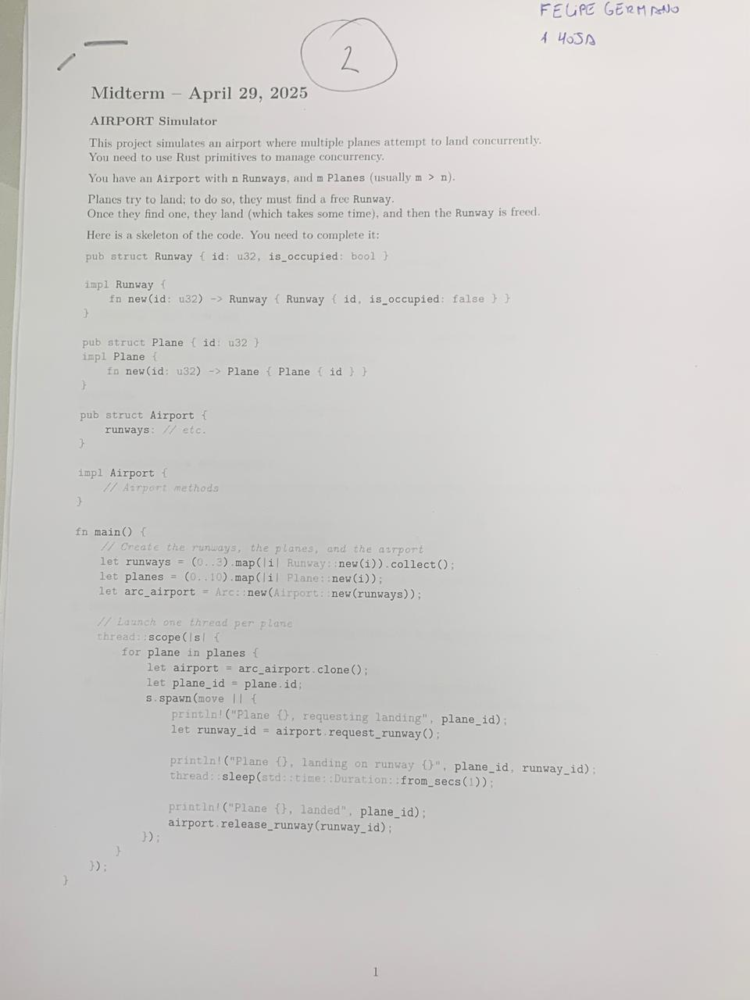
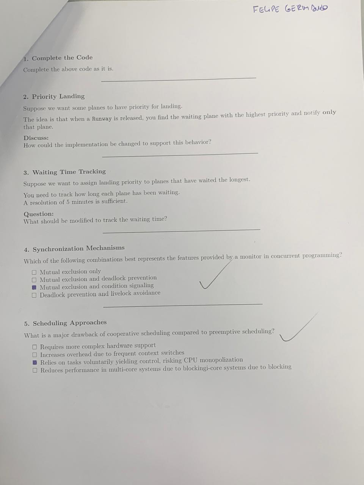

# Consignas



# Resolución
## Primer ejercicio - Airport
```rust
use std::sync::{Condvar, Mutex};

pub struct Runway {
    id: u32,
    is_occupied: bool,
}

impl Runway {
    pub fn new(id: u32) -> Runway {
        Runway {
            id,
            is_occupied: false,
        }
    }
}

pub struct Plane {
    id: u32,
}
impl Plane {
    pub fn new(id: u32) -> Plane {
        Plane { id }
    }
}

pub struct Airport {
    runways: Mutex<Vec<Runway>>,
    can_land: Condvar,
}

impl Airport {
    pub fn new(runway_vec: Vec<Runway>) -> Airport {
        let runways = Mutex::new(runway_vec);
        let can_land = Condvar::new();
        Airport { runways, can_land }
    }
    pub fn request_runway(&self) -> u32 {
        let mut runways = self.runways.lock().unwrap();
        while runways.iter().all(|r| r.is_occupied) {
            runways = self.can_land.wait(runways).unwrap();
        }
        let free_runway: &Runway = runways.iter().find(|r| !r.is_occupied).unwrap();
        free_runway.id
    }

    pub fn release_runway(&self, runway_id: u32) {
        let mut runways = self.runways.lock().unwrap();
        let mut occupied_runway = runways.iter().find(|r| r.id == runway_id).unwrap();
        *occupied_runway.is_occupied = false;
        self.can_land.notify_one();
    }
}
```
- Se wrappea el vector de pistas (`Vec<Runway>`) en un `Mutex` para tener control por exclusión sobre las pistas de aterrizaje.
- Se le suma una `Condvar` para señalizar que pueden aterrizar que, en conjunto con el mutex sobre las pistas, forma un `Monitor`.

## Segundo ejercicio - Priority Landing
Supongamos que queremos que algunos aviones tengan una cierta prioridad de aterrizaje. La idea es que cuando una pista se libere, sólo se le notifica al avión esperando con mayor prioridad.

¿Cómo podemos cambiar la implementación para soportar este comportamiento?

### Respuesta:
Lo ideal sería asignarle una `Condvar` a cada avión, removiendo la del aeropuerto, para así notificarle a los aviones de manera individual. En cuanto a la prioridad, se le asigna un entero que represente esa prioridad (ej: `struct Plane { id: u32, can_land: Condvar, priority: i32 }`)

Además, el aeropuerto tiene que tener una referencia a los aviones en espera (con un `Mutex<Vec<Plane>>`).

Seguido de esto, necesitamos modificar la firma de `request_runway` para que tome como argumento un avión. Si todas las pistas están ocupadas, se agrega al avión al vector de aviones en espera, solicitando primero el lock sobre el Mutex de aviones. Además, se queda esperando a su condvar, la cual actúa sobre el mutex de pistas.

Por último, modificamos `release_runway` para que, al final, busque en el vector de aviones el avión con mayor prioridad y notifique a su condvr, despertando el thread sobre el que se lo usa, y sacándolo del vector.

En "pseudocódigo" sería:
```rust
fn request_runway(plane: Plane){
    let mut runways = self.runways.lock().unwrap();
    let mut waiting_planes = self.planes.lock().unwrap();
    while runways.iter().all(|r| r.is_occupied) {
        runways = plane.can_land.wait(runways).unwrap();
        if(!waiting_planes.contains(plane)){
            waiting_planes.push(plane);
        }
    }
    let free_runway: &Runway = runways.iter().find(|r| !r.is_occupied).unwrap();
    plane.can_land.notify_one();
    free_runway.id
}

fn release_runway(&self, runway_id: u32) {
    let mut runways = self.runways.lock().unwrap();
    let mut occupied_runway = runways.iter().find(|r| r.id == runway_id).unwrap();
    *occupied_runway.is_occupied = false;
    
    let planes = self.planes.lock().unwrap();
    planes.sort_by(|p1, p2| p1.priority.cmp(p2.priority))
    
    let waiting_plane = planes.first();
    waiting_plane.can_land.notify_one();
    planes.remove(waiting_plane);
}

```

En el caso anterior (punto 1), todo lo que teníamos era una manera de señalización aleatoria, la cual depende de la implementación de la `Condvar` o del Scheduler del S.O.

Con este approach, podremos notificar a un sólo avión a la vez, y de manera arbitraria siguiendo el esquema de prioridad definido.


## Tercer ejercicio - Waiting Time Tracking
Supongamos que queremos asignar la prioridad de aterrizaje a los aviones que más esperaron.

Necesitamos trackear cuánto tiempo espera cada avión.
Una resolución de 5 minutos es suficiente.

¿Qué tenemos que modificar de la implementación para lograr esto?

### Respuesta:
Tomamos los cambios del punto anterior con las siguientes modificaciones:
- En lugar de usar el método `wait` de la `Condvar`, usamos `wait_timeout`, con una duración de 5 minutos
- Arrancamos con todos los aviones con prioridad 0
- Con cada timeout, sumamos 5 a la prioridad del avión

De esta manera, la prioridad se maneja en función de tiempo de espera
